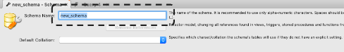
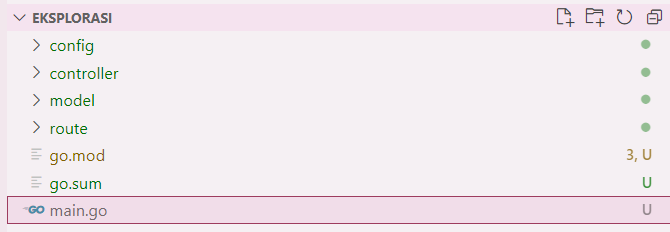
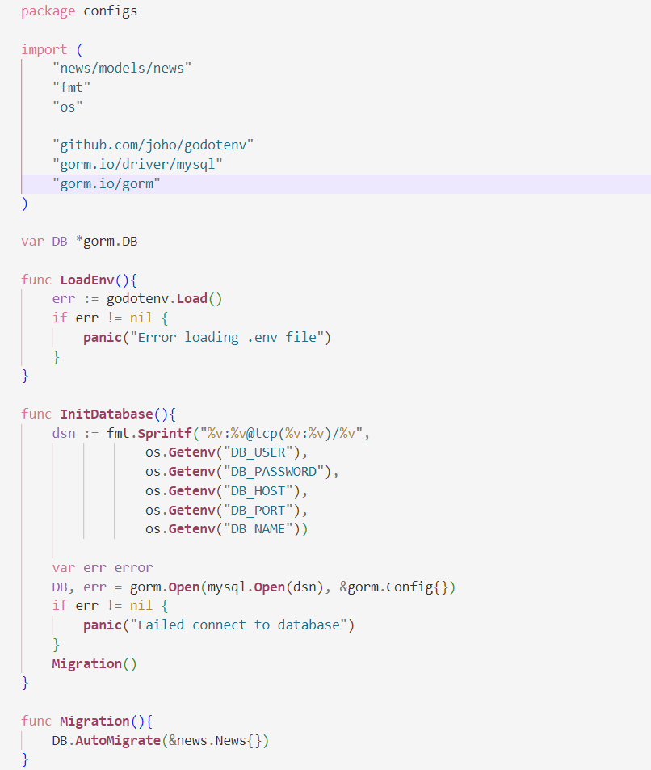
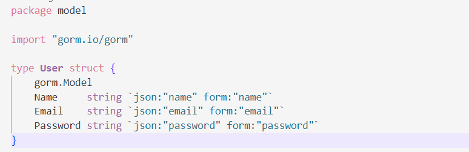
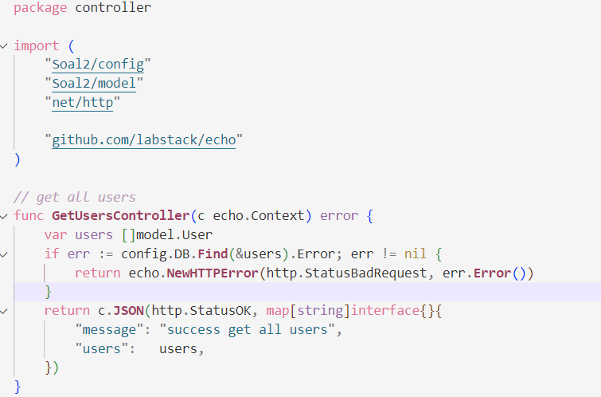
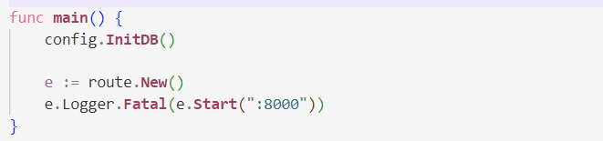
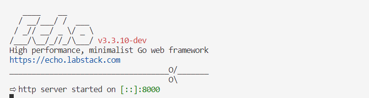

# ORM & Code Structure

## ORM
 ORM adalah teknik pemrograman untuk mengubah data antara sistem tipe yang tidak kompatibel dengan menggunakan bahasa pemrograman berorientasi objek.

 Keuntungan:
 1. Lebih sedikit kueri berulang
 2. Mengambil data secara otomatis ke dalam objek siap pakai
 3. Cara sederhana jika ingin menyaring data sebelum menyimpannya dalam database
 4. Beberapa memiliki fitur cache query

 Kelemahan:
 1. Tambahkan lapisan dalam kode dan timbulkan overhead proses
 2. Memuat data hubungan yang tidak perlu
 3. Kueri SQL mentah yang kompleks bisa sulit ditulis dengan ORM (>10 join tabel)
 4. Fungsi SQL tertentu yang terkait dengan satu vendor mungkin tidak didukung atau tidak ada fungsi tertentu (contoh: MySQL: FORCE INDEX)

 ### Database Migration
 Cara untuk memperbarui versi database agar sesuai dengan perubahan versi aplikasi.

Perubahan dapat berupa pembaruan ke versi terbaru atau pengembalian ke versi sebelumnya.

**Database Relations in GORM:**
1. Belongs to, Cocok untuk hubungan yang saling terhubung. 
2. Has one, Cocok untuk mewakili entitas tunggal yang hanya memiliki satu entitas tepat.
3. Has many, Cocok untuk mewakili entitas tunggal yang memiliki banyak entitas.
4. Many to many, Cocok untuk mewakili banyak entitas yang memiliki banyak entitas. Karakteristik utama dari hubungan ini adalah penggunaan tabel pivot.

**Database Transaction in GORM:**
- Transaksi adalah urutan operasi database. Jika salah satu operasi gagal, maka seluruh transaksi dianggap gagal. 
-  Transaksi berguna untuk memastikan integritas dan konsistensi data. 
- Transaksi didukung dalam GORM.

**Install GORM:** 
- https://gorm.io/docs/
- https://gorm.io/docs/migration.html 

Cara menghubungkan aplikasi Go dengan database :
1. Buat InitDB() untuk Koneksi Database, Fungsi InitDB() untuk membuat koneksi aplikasi ke database.
2. Buat Skema Pengguna & InitialMigration(), Buat skema pengguna untuk database menggunakan Struct (Objek). fungsi InitialMigration() untuk membuat database di MySQL.
3. Panggil InitDB() dan InitialMigration(), Panggil fungsi InitDB() dan InitialMigration() untuk menggunakannya.
4. Buat GetUsersController(), Buat GetUserController() untuk mengambil data pengguna dari basis data (ORM) dan menampilkan data dalam respons.
5. Buat CreateUserController() untuk mengikat data pengguna dari klien dan menyimpan pengguna ke database.
6. Routing, Tentukan routing API RESTful dengan memanggil Controller.

## Code Structure
Menyusun proyek Anda menggunakan Model-View-Controller (MVC)

Alasan menggunakan structure:
- Untuk mencapai aplikasi modular.
- Terapkan pemisahan perhatian.
- Konflik versi yang lebih sedikit.

Code Structuring:
1. Buat database di mysql 
2. Buat folder structure 
3. Buat configuration 
4. Buat model 
5. Buat lib database 
6. Buat controller 
7. Buat router 
8. Buat main 
9. Run 