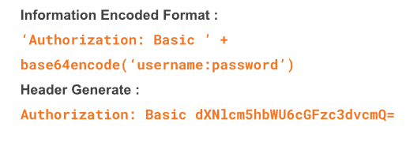
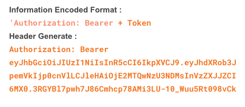

# Middleware
Middleware adalah entitas yang terkait dalam pemrosesan permintaan/respon server.

Contoh middleware pihak ketiga:
- Negroni
- Echo
- Interpose
- Alice

- Setup middleware echo:

    | Echo#Pre() (Dieksekusi sebelum router memproses permintaan)   | Echo#Use() (Dieksekusi setelah router memproses permintaan dan memiliki akses penuh ke echo.Context API)|
    |-----------------|---------------------|
    | HTTPSRedirect          | BodyLimit         |
    | HTTPSWWWRedirect       | Logger  |
    | WWWRedirect         | Gzip  |
    | AddTrailingSlash          | Recover      |
    | RemoveTrailingSlash       | BasicAuth      |
    | MethodeOverride   | JWTAuth       |
    | Rewrite | Secure
    | |CORS
    | |Static

#### CORS Middleware
CORS adalah singkatan dari Cross Origin Resource Sharing yang merupakan sebuah middleware yang digunakan dalam aplikasi web untuk mengatur dan mengontrol izin akses yang diberikan oleh browser ketika permintaan HTTP dilakukan dari asal (origin) yang berbeda. 
- Konfigurasi CORS umum

   | Configuration   | Deskripsi |
    |-----------------|---------------------|
    | Access-Control-Allow-Origin          | Menentukan domain/origin yang dapat mengirim request ke server         |
    | Access-Control-Allow-Headers       | Menentukan request header yang dapat mengirim request ke server  |
    | Access-Control-Allow-Methods         | Menentukan HTTP method yang dapat digunakan ketika mengirim request ke server  |
    | Access-Control-Max-Age          | Menentukan durasi maksimum preflight request yang dapat dilakukan caching      

#### Rate Limiter Middleware
Rate Limiter Middleware adalah sebuah jenis middleware yang digunakan dalam aplikasi web untuk mengatur tingkat penggunaan (rate limit) dari suatu layanan atau endpoint tertentu. Middleware ini berfungsi untuk membatasi jumlah permintaan atau tindakan yang dapat dilakukan oleh pengguna dalam interval waktu tertentu.

#### Log Middleware
- Mencatat informasi permintaan HTTP
- Sebagai jejak kaki
- Sumber data untuk analisi

#### Auth Middleware
Mengapa menggunakan authentikasi? karena sebagai indetifikasi pengguna dan mengamankan data juga informasi. 

Authentication Middleware:
1. Basic Authentication: permintaan teknik otentikasi http, metode ini memerlukan informasi nama pengguna dan kata sandi untuk dimasukkan ke dalam header permintaan. 

2. JSON Web Token: jenis middleware yang digunakan dalam aplikasi web untuk melakukan otentikasi dan otorisasi berdasarkan token JWT.
